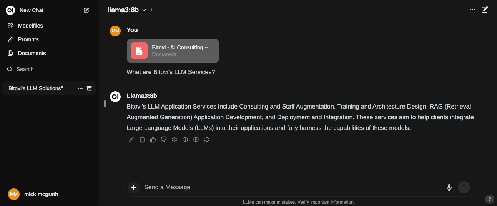

# Deploy Ollama and Open WebUI with GitHub Actions 🌐🚀

Welcome to the easiest way to get your own hosted private language model running swiftly with [Ollama](https://github.com/ollama/ollama) and [Open WebUI](https://github.com/open-webui/open-webui)




## Why use this action?

With this action, you can easily have your very own Large Language Model (LLM) like OpenAI's GPTChat or Anthropic's Claude.  Except that it's entirely yours!  You can tune it with your own data, and it's hosted on your own AWS account.

This action is perfect for anyone who wants to try out the latest models, ask questions about documents, or even build Retrieval Augmented Generation (RAG) apps against an LLM you own!

🖥️✨ Get started below, and you'll be talking with your own hosted LLM in no time!

Supported Cloud Providers:
- AWS

> **Note:** This action is currently in beta.  Please report any issues you find by creating [an Issue](https://github.com/bitovi/github-actions-deploy-ollama/issues/new) or a [Pull Requests](https://github.com/bitovi/github-actions-deploy-ollama/pulls)


<!-- ## Getting Started Intro Video
[](https://www.youtube.com/watch?v=oya5LuHUCXc) -->


## Need help or have questions?
This project is supported by [Bitovi DevOps](https://www.bitovi.com/devops-consulting) and a proud supporter of Open Source software.

You can **get help or ask questions** on our [Discord channel](https://discord.gg/J7ejFsZnJ4)! Come hang out with us; We love discussing solutions!

Or, you can hire us for training, consulting, development, and deployments (including LLM deployments ;). [Set up a free consultation](https://www.bitovi.com/devops-consulting).


## Requirements

This is a list of requirements you'll need to meet in order to use this action.
1. An AWS account (yep, that's it!)


### 1. An AWS account
You'll need [Access Keys](https://docs.aws.amazon.com/powershell/latest/userguide/pstools-appendix-sign-up.html) from an [AWS account](https://aws.amazon.com/premiumsupport/knowledge-center/create-and-activate-aws-account/)


## Example usage

<!-- > **Secrets first!** First, fill out the values in the `.env.example` file. Then, create a secret in your repo called `DOT_ENV` and paste the contents into it. (Do NOT commit any files with your secrets in them!) -->


Create `.github/workflow/deploy.yaml` with the following to build on push.

### Basic example
```yaml
name: Basic deploy
on:
  push:
    branches: [ main ]

jobs:
  Ollama-Deploy:
    runs-on: ubuntu-latest
    steps:
    - id: deploy
      name: Deploy
      uses: bitovi/github-actions-deploy-ollama@v1
      with:
        aws_access_key_id: ${{ secrets.AWS_ACCESS_KEY_ID}}
        aws_secret_access_key: ${{ secrets.AWS_SECRET_ACCESS_KEY}}
```

> Once deployed, visit the url provided in the workflow output summary.


### Advanced example
```yaml
name: Advanced deploy
on:
  push:
    branches: [ main ]

jobs:
  Ollama-Deploy:
    runs-on: ubuntu-latest
    steps:
    - id: deploy
      name: Deploy
      uses: bitovi/github-actions-deploy-ollama@v1
      with:
        disable_signup: true
        ollama_models: "phi3,qwen:0.5b,tinyllama"
        
        aws_access_key_id: ${{ secrets.AWS_ACCESS_KEY_ID}}
        aws_secret_access_key: ${{ secrets.AWS_SECRET_ACCESS_KEY}}

        aws_r53_enable: true
        aws_r53_domain_name: bitovi.com
        aws_r53_sub_domain_name: ollama
        aws_r53_create_sub_cert: true

        ansible_start_docker_timeout: 9000

        env_ghs: ${{ secrets.DOT_ENV }}
        env_ghv: ${{ vars.VARS }}
        env_aws_secret: some-secret,some-other
        
        docker_cloudwatch_enable: true
        docker_cloudwatch_retention_days: 7
```

## Customizing

### Inputs
1. [Deploy specifics](#deploy-specifics)
1. [AWS Specific](#aws-specific)
1. [GitHub Commons main inputs](#github-commons-main-inputs)
1. [Secrets and Environment Variables](#secrets-and-environment-variables-inputs)
1. [EC2](#ec2-inputs)
1. [VPC](#vpc-inputs)
1. [AWS Route53 Domains and Certificates](#aws-route53-domains-and-certificate-inputs)
1. [Docker](#docker-inputs)

### Outputs
1. [Action Outputs](#action-outputs)

The following inputs can be used as `step.with` keys
<br/>
<br/>

#### **Deploy Specific**
| Name             | Type    | Description                        |
|------------------|---------|------------------------------------|
| `disable_signup` | Boolean | Disable user signup for the application. |
| `ollama_models` | String | Comma separated list of models to download automatically. e.g. `"mistral,deepseek-r1,llama3.3"` [Check models](https://ollama.com/search) |

#### **AWS Specific**
| Name             | Type    | Description                        |
|------------------|---------|------------------------------------|
| `aws_access_key_id` | String | AWS access key ID |
| `aws_secret_access_key` | String | AWS secret access key |
| `aws_session_token` | String | AWS session token |
| `aws_default_region` | String | AWS default region. Defaults to `us-east-1` |
| `aws_resource_identifier` | String | Set to override the AWS resource identifier for the deployment. Defaults to `${GITHUB_ORG_NAME}-${GITHUB_REPO_NAME}-${GITHUB_BRANCH_NAME}`. |
| `aws_additional_tags` | JSON | Add additional tags to the terraform [default tags](https://www.hashicorp.com/blog/default-tags-in-the-terraform-aws-provider), any tags put here will be added to all provisioned resources.|
<hr/>
<br/>


#### **GitHub Commons main inputs**
| Name             | Type    | Description                        |
|------------------|---------|------------------------------------|
| `checkout` | Boolean | Set to `false` if the code is already checked out. (Default is `true`). |
| `tf_stack_destroy` | Boolean  | Set to `true` to destroy the stack - Will delete the `elb logs bucket` after the destroy action runs. |
| `tf_state_file_name` | String | Change this to be anything you want to. Carefull to be consistent here. A missing file could trigger recreation, or stepping over destruction of non-defined objects. Defaults to `tf-state-aws`. |
| `tf_state_file_name_append` | String | Appends a string to the tf-state-file. Setting this to `unique` will generate `tf-state-aws-unique`. (Can co-exist with `tf_state_file_name`) |
| `tf_state_bucket` | String | AWS S3 bucket name to use for Terraform state. See [note](#s3-buckets-naming) | 
| `tf_state_bucket_destroy` | Boolean | Force purge and deletion of S3 bucket defined. Only evaluated when `tf_stack_destroy` is also `true`, so it is safe to leave this enabled when standing up your stack. Defaults to `false`. |
| `ansible_ssh_to_private_ip` | Boolean | Make Ansible connect to the private IP of the instance. Only usefull if using a hosted runner in the same network. Default is `false`. | 
| `ansible_start_docker_timeout` | String | Ammount of time in seconds it takes Ansible to mark as failed the startup of docker. Defaults to `6000`.|
<hr/>
<br/>

#### **Secrets and Environment Variables Inputs**
| Name             | Type    | Description - Check note about [**environment variables**](#environment-variables). |
|------------------|---------|------------------------------------|
| `env_aws_secret` | String | Secret name to pull env variables from AWS Secret Manager, could be a comma separated list, read in order. Expected JSON content. |
| `env_repo` | String | File containing environment variables to be used with the app. |
| `env_ghs` | String | `.env` file to be used with the app from Github secrets. |
| `env_ghv` | String | `.env` file to be used with the app from Github variables. |
<hr/>
<br/>

#### **EC2 Inputs**
| Name             | Type    | Description                        |
|------------------|---------|------------------------------------|
| `aws_ec2_instance_create` | Boolean | Toggles the creation of an EC2 instance. (Default is `true`). |
| `aws_ec2_ami_filter` | String | AWS AMI Filter string. Will be used to lookup for lates image based on the string. Defaults to `ubuntu/images/hvm-ssd/ubuntu-jammy-22.04-amd64-server-*`.' |
| `aws_ec2_ami_owner` | String | Owner of AWS AMI image. This ensures the provider is the one we are looking for. Defaults to `099720109477`, Canonical (Ubuntu). |
| `aws_ec2_ami_id` | String | AWS AMI ID. Will default to the latest Ubuntu 22.04 server image (HVM). Accepts `ami-###` values. |
| `aws_ec2_ami_update` | Boolean | Set this to `true` if you want to recreate the EC2 instance if there is a newer version of the AMI. Defaults to `false`.|
| `aws_ec2_instance_type` | String | The AWS IAM instance type to use. Default is `inf1.xlarge`. See [this list](https://aws.amazon.com/ec2/instance-types/) for reference. |
| `aws_ec2_instance_root_vol_size` | Integer | Define the volume size (in GiB) for the root volume on the AWS Instance. Defaults to `8`. | 
| `aws_ec2_instance_root_vol_preserve` | Boolean | Set this to true to avoid deletion of root volume on termination. Defaults to `false`. | 
| `aws_ec2_security_group_name` | String | The name of the EC2 security group. Defaults to `SG for ${aws_resource_identifier} - EC2`. |
| `aws_ec2_iam_instance_profile` | String | The AWS IAM instance profile to use for the EC2 instance. Will create one if none provided with the name `aws_resource_identifier`. |
| `aws_ec2_create_keypair_sm` | Boolean | Generates and manages a secret manager entry that contains the public and private keys created for the ec2 instance. |
| `aws_ec2_instance_public_ip` | Boolean | Add a public IP to the instance or not. (Not an Elastic IP). Defaults to `true`. |
| `aws_ec2_port_list` | String | Comma separated list of ports to be enabled in the EC2 instance security group. (NOT THE ELB) In a `80,443` format. Port `22` is enabled as default to allow Ansible connection. |
| `aws_ec2_additional_tags` | JSON | Add additional tags to the terraform [default tags](https://www.hashicorp.com/blog/default-tags-in-the-terraform-aws-provider), any tags put here will be added to ec2 provisioned resources.|
<hr/>
<br/>

#### **VPC Inputs**
| Name             | Type    | Description                        |
|------------------|---------|------------------------------------|
| `aws_vpc_create` | Boolean | Define if a VPC should be created. Defaults to `false`. |
| `aws_vpc_name` | String | Define a name for the VPC. Defaults to `VPC for ${aws_resource_identifier}`. |
| `aws_vpc_cidr_block` | String | Define Base CIDR block which is divided into subnet CIDR blocks. Defaults to `10.0.0.0/16`. |
| `aws_vpc_public_subnets` | String | Comma separated list of public subnets. Defaults to `10.10.110.0/24`|
| `aws_vpc_private_subnets` | String | Comma separated list of private subnets. If no input, no private subnet will be created. Defaults to `<none>`. |
| `aws_vpc_availability_zones` | String | Comma separated list of availability zones. Defaults to `aws_default_region+<random>` value. If a list is defined, the first zone will be the one used for the EC2 instance. |
| `aws_vpc_id` | String | **Existing** AWS VPC ID to use. Accepts `vpc-###` values. |
| `aws_vpc_subnet_id` | String | **Existing** AWS VPC Subnet ID. If none provided, will pick one. (Ideal when there's only one). |
| `aws_vpc_enable_nat_gateway` | Boolean | Adds a NAT gateway for each public subnet. Defaults to `false`. |
| `aws_vpc_single_nat_gateway` | Boolean | Toggles only one NAT gateway for all of the public subnets. Defaults to `false`. |
| `aws_vpc_external_nat_ip_ids` | String | **Existing** comma separated list of IP IDs if reusing. (ElasticIPs). |
| `aws_vpc_additional_tags` | JSON | Add additional tags to the terraform [default tags](https://www.hashicorp.com/blog/default-tags-in-the-terraform-aws-provider), any tags put here will be added to vpc provisioned resources.|
<hr/>
<br/>

#### **AWS Route53 Domains and Certificate Inputss**
| Name             | Type    | Description                        |
|------------------|---------|------------------------------------|
| `aws_r53_enable` | Boolean | Set this to true if you wish to use an existing AWS Route53 domain. **See note**. Default is `false`. |
| `aws_r53_domain_name` | String | Define the root domain name for the application. e.g. bitovi.com'. |
| `aws_r53_sub_domain_name` | String | Define the sub-domain part of the URL. Defaults to `aws_resource_identifier`. |
| `aws_r53_root_domain_deploy` | Boolean | Deploy application to root domain. Will create root and www records. Default is `false`. |
| `aws_r53_enable_cert` | Boolean | Set this to true if you wish to manage certificates through AWS Certificate Manager with Terraform. **See note**. Default is `false`. | 
| `aws_r53_cert_arn` | String | Define the certificate ARN to use for the application. **See note**. |
| `aws_r53_create_root_cert` | Boolean | Generates and manage the root cert for the application. **See note**. Default is `false`. |
| `aws_r53_create_sub_cert` | Boolean | Generates and manage the sub-domain certificate for the application. **See note**. Default is `false`. |
| `aws_r53_additional_tags` | JSON | Add additional tags to the terraform [default tags](https://www.hashicorp.com/blog/default-tags-in-the-terraform-aws-provider), any tags put here will be added to R53 provisioned resources.|
<hr/>
<br/>

#### **Docker Inputs**
| Name             | Type    | Description                        |
|------------------|---------|------------------------------------|
| `docker_install` | Boolean | Toggle docker installation through Ansible. `docker-compose up` will be excecuted after. Defaults to `true`. |
| `docker_remove_orphans` | Boolean | Set to `true` to turn the `--remove-orphans` flag. Defaults to `false`. |
| `docker_full_cleanup` | Boolean | Set to `true` to run `docker-compose down` and `docker system prune --all --force --volumes` after. Runs before `docker_install`. WARNING: docker volumes will be destroyed. |
| `docker_repo_app_directory_cleanup` | Boolean | Will generate a timestamped compressed file (in the home directory of the instance) and delete the app repo directory. Runs before `docker_install` and after `docker_full_cleanup`. |
| `docker_cloudwatch_enable` | Boolean | Toggle cloudwatch creation for Docker. Create a file named `docker-daemon.json` in your repo root dir if you need to customize it. Defaults to `false`. Check [docker docs](https://docs.docker.com/config/containers/logging/awslogs/).|
| `docker_cloudwatch_lg_name` | String| Log group name. Will default to `${aws_resource_identifier}-docker-logs` if none. |
| `docker_cloudwatch_skip_destroy` | Boolean | Toggle deletion or not when destroying the stack. Defaults to `false`. |
| `docker_cloudwatch_retention_days` | String | Number of days to retain logs. 0 to never expire. Defaults to `14`. See [note](https://registry.terraform.io/providers/hashicorp/aws/latest/docs/resources/cloudwatch_log_group#retention_in_days). |
<hr/>
<br/>

#### **Action Outputs**
| Name             | Description                        |
|------------------|------------------------------------|
| **VPC** |
| `aws_vpc_id` | The selected VPC ID used. |
| **EC2** |
| `vm_url` | The URL of the generated app. |
| `instance_endpoint` | The URL of the generated ec2 instance. |
| `ec2_sg_id` | SG ID for the EC2 instance. |
<hr/>
<br/>


## Environment variables

For envirnoment variables in your app, you can provide:
 - `env_repo` - A file in your repo that contains env vars
 - `env_ghv` - An entry in [Github actions variables](https://docs.github.com/en/actions/learn-github-actions/variables)
 - `env_ghs` - An entry in [Github secrets](https://docs.github.com/es/actions/security-guides/encrypted-secrets)
 - `env_aws_secret` - The path to a JSON format secret in AWS
 
These environment variables are merged (in the following order) to the .env file and provided to both the Prometheus and Grafana services:
 - Terraform passed env vars ( This is not optional nor customizable )
 - Repository checked-in env vars - repo_env file as default. (KEY=VALUE style)
 - Github Secret - Create a secret named DOT_ENV - (KEY=VALUE style)
 - AWS Secret - JSON style like '{"key":"value"}'

## Note about resource identifiers

Most resources will contain the tag `${GITHUB_ORG_NAME}-${GITHUB_REPO_NAME}-${GITHUB_BRANCH_NAME}`, some of them, even the resource name after. 
We limit this to a 60 characters string because some AWS resources have a length limit and short it if needed.

We use the kubernetes style for this. For example, kubernetes -> k(# of characters)s -> k8s. And so you might see some compressions are made.

For some specific resources, we have a 32 characters limit. If the identifier length exceeds this number after compression, we remove the middle part and replace it for a hash made up from the string itself. 

### S3 buckets naming

Buckets names can be made of up to 63 characters. If the length allows us to add -tf-state, we will do so. If not, a simple -tf will be added.

## CERTIFICATES - Only for AWS Managed domains with Route53

As a default, the application will be deployed and the ELB public URL will be displayed.

If `aws_r53_enable` and `aws_r53_enable_cert` are true, we will look up for a certificate with the name of the domain defined in `aws_r53_domain_name`. (eg. `example.com`). We expect that certificate to contain both `example.com` and `*.example.com` in the defined region.

Setting `aws_r53_create_root_cert` to `true` will create this certificate with both `example.com` and `*.example.com` for you, and validate them. (DNS validation).

Setting `aws_r53_create_sub_cert` to `true` will create a certificate **just for the subdomain**, and validate it.

> :warning: Be very careful here! **Created certificates are fully managed by Terraform**. Therefor **they will be destroyed upon stack destruction**.

To change a certificate (root_cert, sub_cert, ARN or pre-existing root cert), you must first toogle  `aws_r53_enable_cert` to false, run the action, and then set the `aws_r53_enable_cert` flag to true, add the desired settings and excecute the action again. (**This will destroy the first certificate.**)

This is necessary due to a limitation that prevents certificates from being changed while in use by certain resources.

## Made with BitOps
[BitOps](https://bitops.sh) allows you to define Infrastructure-as-Code for multiple tools in a central place.  This action uses a BitOps [Operations Repository](https://bitops.sh/operations-repo-structure/) to set up the necessary Terraform and Ansible to create infrastructure and deploy to it.

## Contributing
We would love for you to contribute to [bitovi/github-actions-deploy-ollama](https://github.com/bitovi/github-actions-deploy-ollama) and help make it even better than it is today!

Would you like to see additional features?  [Create an issue](https://github.com/bitovi/github-actions-deploy-ollama/issues/new) or a [Pull Requests](https://github.com/bitovi/github-actions-deploy-ollama/pulls).

## License
The scripts and documentation in this project are released under the [MIT License](https://github.com/bitovi/github-actions-deploy-ollama/blob/main/LICENSE).
